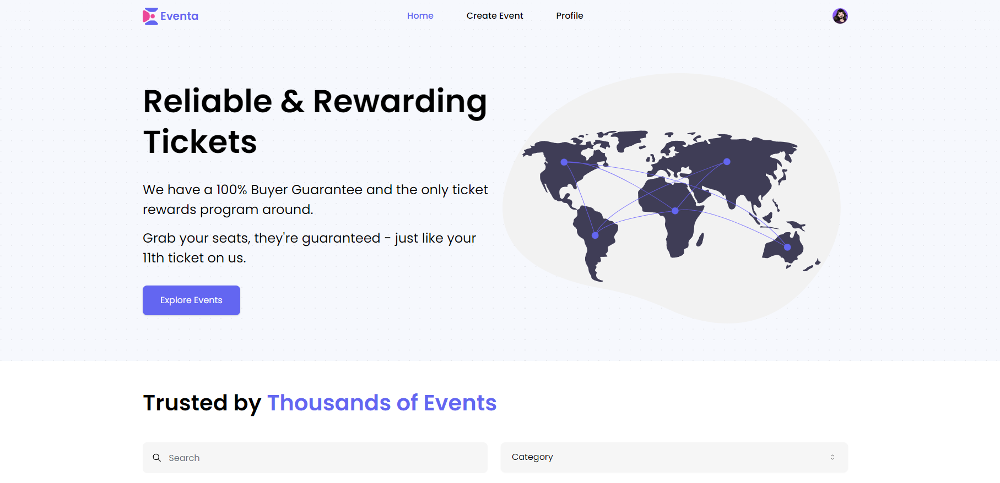

# Eventa

> Eventa is a platform where users can create and manage their own events, share them with others, and sell tickets seamlessly. Discover upcoming conferences, concerts, festivals, and more. Buy and sell event tickets with ease on Eventa.

## Table of Contents

- [Live Demo](#live-demo)
- [Screen](#screen)
- [Features](#features)
- [Technologies Used](#technologies-used)
- [Getting Started](#getting-started)
- [License](#license)

## Live Demo

- You can access the live demo via [Vercel](https://eventa-web.vercel.app/).

## Screen

[](https://eventa-web.vercel.app/)

## Features

**Here are some of the current features that Eventa has:**

- [x] User authentication
- [x] Route protection
- [x] Event listing
- [x] CRUD operations
- [x] Advanced search
- [x] State management
- [x] Responsive design

## Technologies Used

**Eventa uses the following technologies:**

- [Next.js](https://nextjs.org/)
- [React](https://reactjs.org/)
- [Tailwind CSS](https://tailwindcss.com/)
- [shadcn/ui](https://ui.shadcn.com/)
- [MongoDB](https://www.mongodb.com/)
- [Prisma](https://www.prisma.io/)
- [Zod](https://zod.dev/)
- [Clerk](https://clerk.com/)
- [Stripe](https://stripe.com/)
- [uploadthing](https://uploadthing.com/)

## Getting Started

#### Prerequisites

- [Node.js](https://nodejs.org/en) version 20 or higher
- Sign up and create a new project at [MongoDB](https://account.mongodb.com/account/register)
- Sign up and create a new application at [Clerk](https://dashboard.clerk.com/sign-up)
- Sign up and create a new account at [Stripe](https://dashboard.stripe.com/register)
- Sign up and create a new account at [uploadthing](https://uploadthing.com/sign-in)


#### `.env` File

Create `.env` file and fill in the following environment variables:

```
NEXT_PUBLIC_SERVER_URL=[http://localhost:3000 | CHANGE_AFTER_DEPLOYMENT]
NEXT_PUBLIC_CLERK_PUBLISHABLE_KEY=[YOUR_PUBLIC_CLERK_KEY]
CLERK_SECRET_KEY=[YOUR_CLERK_SECRET_KEY]
NEXT_PUBLIC_CLERK_SIGN_IN_URL=/sign-in
NEXT_PUBLIC_CLERK_SIGN_UP_URL=/sign-up
WEBHOOK_SECRET=[YOUR_CLERK_SECRET_FOR_WEBHOOK]
DATABASE_URL=[YOUR_DATABASE_URL]
UPLOADTHING_TOKEN=[YOUR_UPLOADTHING_TOKEN]
NEXT_PUBLIC_STRIPE_PUBLISHABLE_KEY=[YOUR_PUBLIC_STRIPE_KEY]
STRIPE_SECRET_KEY=[YOUR_SECRET_STRIPE_KEY]
STRIPE_WEBHOOK_SECRET=[YOUR_STRIPE_SECRET_FOR_WEBHOOK]
```

#### Clone the repository

```bash
git clone https://github.com/akabaytar/eventa-web.git
```

#### Navigate to the project directory

```bash
cd eventa-web
```

#### Install Dependencies

```bash
npm install
```

#### Run the Development Server

```bash
npm run dev
```

Open [http://localhost:3000](http://localhost:3000) with your browser to see the result.

## License

This project is licensed under the MIT License - see the [LICENSE](LICENSE.md) file for details
